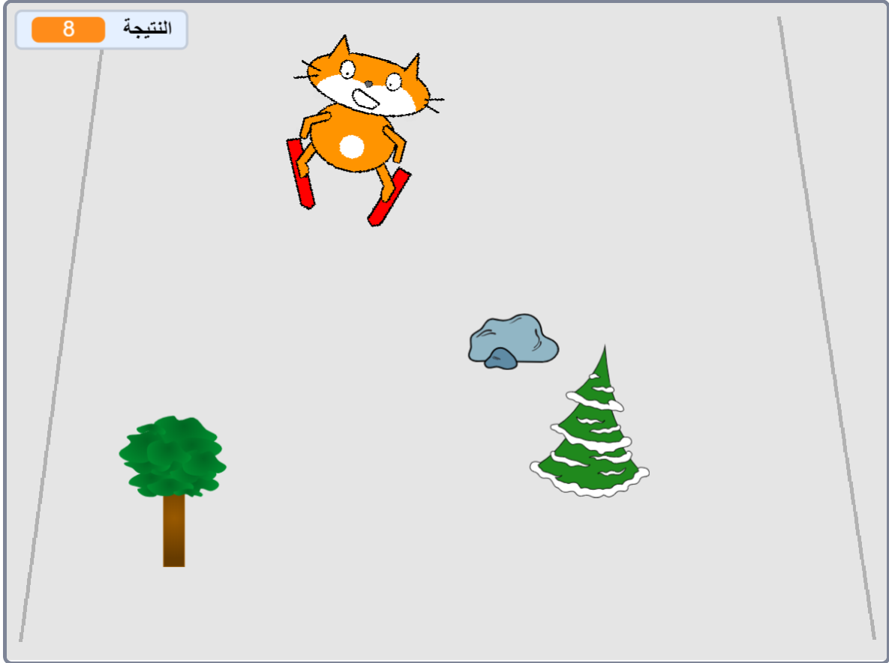

--- no-print ---

هذا هو إصدار **Scratch 3** من المشروع. هناك أيضًا [إصدار Scratch 2 للمشروع](https://projects.raspberrypi.org/ar-SA/projects/scratch-cat-goes-skiing-scratch2).

--- /no-print ---

## المقدمة

ستستخدم سكراتش لإنشاء لعبة تزلج عليك فيها تجنب ظهور عوائق بشكل عشوائي لتسجيل النقاط.

### ما الذي ستصنعه

--- no-print ---

أنقر على العلم الأخضر للبدء. استخدم مفتاحي السهم الأيمن والأيسر للتحكم في المتزلج.

  <iframe allowtransparency="true" width="485" height="402" src="//scratch.mit.edu/projects/embed/406816951/?autostart=false" frameborder="0" scrolling="no"></iframe>
  

--- /no-print ---

--- print-only ---

--- /print-only ---

--- collapse ---
---
title: ما ستحتاج إليه
---

### الأجهزة

+ جهاز حاسوب يدعم تشغيل برنامج Scratch

### البرامج

+ برنامج Scratch 3 (سواء أكان [عبر الإنترنت](http://rpf.io/scratchon){:target="_blank"} أو [دون اتصال بالإنترنت](http://rpf.io/scratchoff){:target="_blank"})

### التحميلات

يمكن العثور على المشروع الاولي [هنا](http://rpf.io/p/ar-SA/scratch-cat-goes-skiing-go){:target="_blank"}.

--- /collapse ---

--- collapse ---
---
title: ما الذي ستتعلمه
---

+ كيفية التحكم في الكائنات باستخدام لوحة المفاتيح
+ كيفية رسم خلفية
+ كيفية تحريك الكائنات
+ استخدم أرقام عشوائية

--- /collapse ---

--- collapse ---
---
title: معلومات إضافية للمعلمين
---

--- no-print ---

إذا كنت بحاجة إلى طباعة هذا المشروع ، فالرجاء استخدام الإصدار [الملائم للطابعة](https://projects.raspberrypi.org/ar-SA/projects/scratch-cat-goes-skiing/print){:target="_blank"}.

--- /no-print ---

يمكنك الحصول على [المشروع كاملاً من هنا](http://rpf.io/p/ar-SA/scratch-cat-goes-skiing-get){:target="_blank"}.

--- /collapse ---
