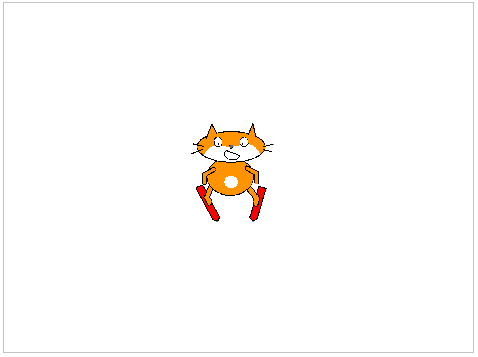
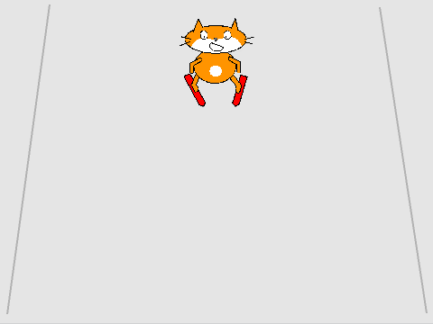

## الخطوة الأولى

--- task ---

افتح مشروع جديد من برنامج سكراتش.

**متصل بالانترنت**: افتح المشروع الاولي من هنا [rpf.io/skiingon](http://rpf.io/skiingon){:target="_blank"}.

اذا كنت تملك حساب على منصة Scratch فيمكنك عمل نسخة بالضغط على **Remix**.

**دون اتصال بالانترنت**: افتح [المشروع الاولي](http://rpf.io/p/en/scratch-cat-goes-skiing-go){:target="_blank"} عبر المحرر الموجود على جهازك.

اذا كنت تحتاج تنزيل و تنصيب محرر Scratch للعمل دون اتصال بالانترنت, فيمكنك ايجاده على الرابط [rpf.io/scratchoff](http://rpf.io/scratchoff){:target="_blank"}.

في المشروع الاولي ، من المفترض أن ترى خلفية فارغة مع الكائن المتزلج.



--- /task ---

--- task ---

ارسم خلفية جديدة لمنحدر التزلج الخاص بك: املأ الخلفية باللون الرمادي وأضف بعض الخطوط المستقيمة.


[[[generic-scratch3-paint-new-backdrop]]]

--- /task ---

--- task ---

أضف كود برمجي إلى الكائن المتزلج الخاص بك بحيث يظهر في الاعلى ويواجه المنحدر ` عند النقر على العلم ` {: class = "block3events"}.




```blocks3
when green flag clicked
go to x: (0) y: (100)
point in direction (90 v)
```

--- /task ---

--- task ---

إختبر واحفظ المشروع الخاص بك.

[[[generic-scratch3-saving]]]

--- /task ---
