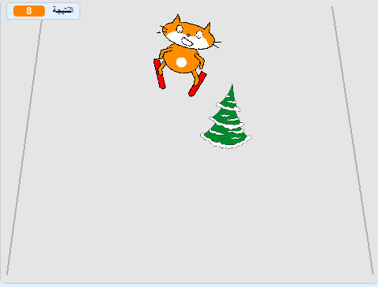

## إضافة النتيجة

في كل مرة الكائن المتزلج يتخطى عقبة، يجب أن يكتسب نقاط.



--- task ---

`اصنع متغير جديد`{:class="block3variables"} يسمى `النتيجة`{:class="block3variables"}

--- /task ---

--- task ---

أضف كود برمجي إلى كائن العقبة لتعيين `النتيجة `{:class="block3variables"} إلى الصفر في بداية اللعبة.

[[[generic-scratch3-add-variable]]]


```blocks3
when green flag clicked
+ set [score v] to [0]
```

--- /task ---

--- task ---

قم بتغيير الكود البرمجي بحيث عندما تصل العائق إلى أعلى الشاشة ، فإنه ` يغير النتيجة بمقدار 1 ` {: class = "block3variables"}.

يجب أن يبدو االكود البرمجي المحدث للكائن على النحو التالي:


```blocks3
when green flag clicked
set [score v] to [0]
forever 
    set [obstacle_x v] to (pick random (-200) to (200))
    go to x: (obstacle_x) y: (-180)
    show
    glide (1) secs to x: (obstacle_x) y: (180)
    hide
    wait (0.5) seconds
+   change [score v] by (1)
end
```

--- /task ---

--- task ---

العب اللعبة ، تعرف على عدد النقاط التي يمكنك تسجيلها.

--- /task ---