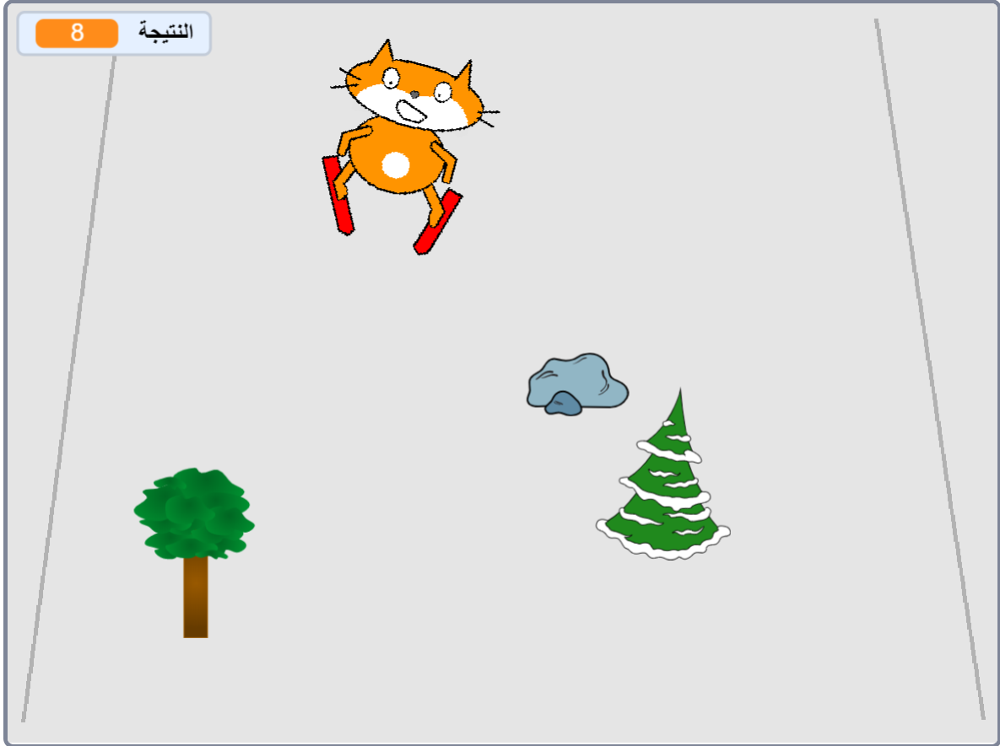

## التحدي: إضافة المزيد من العقبات

أضف المزيد من الكائنات من المكتبة كعقبات لجعل لعبتك اصعب!

عندما تضيف عقبة جديدة ، ستحتاج إلى التفكير في:

1. أي كائن يمكن استخدامه
1. ماذا يحدث عندما يتحطم المتزلج عليها
1. ما إذا كنت تريد زيادة النتيجة (ومقدارها) عندما يكون المتزوج قد تجاوز العقبة او لا

إذا كنت بحاجة إلى المساعدة ، فارجع إلى الخطوة في هذا المشروع حيث أنشأت أول عقبة.

