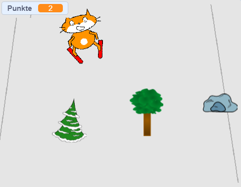

--- no-print ---

Dies ist die **Scratch 3** Version des Projekts. Es gibt auch eine [Scratch 2 Version des Projekts](https://projects.raspberrypi.org/en/projects/scratch-cat-goes-skiing-scratch2).

--- /no-print ---

## Einleitung

Mit Scratch erstellst du ein Skispiel, bei dem du zufällig auftretende Hindernisse vermeiden musst, um Punkte zu erzielen.

### Was du machen wirst

--- no-print ---

Klicke zum Starten auf die grüne Flagge. Verwende die linke und rechte Pfeiltaste, um den Skifahrer zu steuern.

  <iframe allowtransparency="true" width="485" height="402" src="//scratch.mit.edu/projects/embed/281116583/?autostart=false" frameborder="0" scrolling="no"></iframe>
  

--- /no-print ---

--- print-only ---

--- /print-only ---

--- collapse ---
---
title: Was du brauchen wirst
---

### Hardware

+ Ein Computer, auf dem Scratch ausgeführt werden kann

### Software

+ Scratch 3 (either [online](https://rpf.io/scratchon){:target="_blank"} or [offline](https://rpf.io/scratchoff){:target="_blank"})

### Downloads

The starter project can be found [here](https://rpf.io/p/en/scratch-cat-goes-skiing-go){:target="_blank"}.

--- /collapse ---

--- collapse ---
---
title: Was du lernen wirst
---

+ Wie du Figuren über die Tastatur steuerst
+ Wie man einen Hintergrund zeichnet
+ Wie man Figuren animiert
+ Wie man Zufallszahlen verwendet

--- /collapse ---

--- collapse ---
---
title: Zusätzliche Informationen für Pädagogen
---

--- no-print ---

Wenn du dieses Projekt ausdrucken möchtest, verwende die [druckerfreundliche Version](https://projects.raspberrypi.org/en/projects/scratch-cat-goes-skiing/print){:target="_blank"}.

--- /no-print ---

You can find the [completed project here](https://rpf.io/p/en/scratch-cat-goes-skiing-get){:target="_blank"}.

--- /collapse ---
