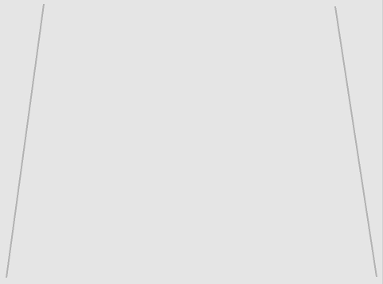

## Erste Schritte

--- task ---

Öffne das Scratch Start-Projekt.

**Online**: Öffne das Start-Projekt: [scratch.mit.edu/projects/405915786](https://scratch.mit.edu/projects/405915786){:target="_blank"}.

Wenn du bereits einen Scratch-Account besitzt, kannst du dir durch Klick auf **Remix** eine Kopie anlegen.

**Offline**: Öffne das [Start-Projekt](http://rpf.io/p/de-DE/scratch-cat-goes-skiing-go){:target="_blank"} im Offline-Editor.

Wenn du den Scratch-Offline-Editor herunterladen und installieren möchtest, findest du diesen unter [rpf.io/scratchoff](http://rpf.io/scratchoff){:target="_blank"}.

Im Starterprojekt solltest du einen leeren Hintergrund und eine Skifahrer-Figur sehen.


--- /task ---

--- task ---

Male einen neuen Hintergrund für deine Skipiste: Fülle den Hintergrund grau und füge einige gerade Linien hinzu.



[[[generic-scratch3-paint-new-backdrop]]]

--- /task ---

--- task ---

Füge deiner Skifahrer-Katzenfigur einen Code hinzu, sodass sie oben auf der Piste und bergab angezeigt wird `wenn Flagge angeklickt wird`{:class="block3events"}.


```blocks3
when green flag clicked
go to x: (0) y: (100)
point in direction (90 v)
```

--- /task ---

--- task ---

Speichere und teste dein Projekt.

[[[generic-scratch3-saving]]]

--- /task ---
