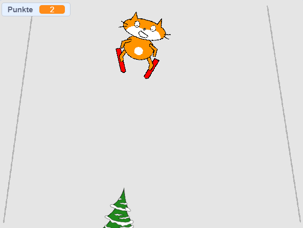

## Eine Punktzahl hinzufügen

Jedes Mal, wenn die Skifahrer-Figur ein Hindernis überwindet, sollte sie Punkte sammeln.



--- task ---

Erstelle eine `Neue Variable`{:class="block3variables"} mit dem Namen `Punkte`{:class="block3variables"}

--- /task ---

--- task ---

Füge der Hindernis-Figur ein Skript hinzu, um die `Punkte`{:class="block3variables"} zu Beginn des Spiels auf Null zu setzen.

[[[generic-scratch3-add-variable]]]


```blocks3
when green flag clicked
+ set [score v] to [0]
```

--- /task ---

--- task ---

Ändere den Code so, dass wenn das Hindernis an den oberen Rand des Bildschirms gelangt, `Punktzahl um 1 geändert`{:class="block3variables"} wird.

Das aktualisierte Skript für die Figur sollte folgendermaßen aussehen:


```blocks3
when green flag clicked
set [score v] to [0]
forever 
    set [obstacle_x v] to (pick random (-200) to (200))
    go to x: (obstacle_x) y: (-180)
    show
    glide (1) secs to x: (obstacle_x) y: (180)
    hide
    wait (0.5) seconds
+   change [score v] by (1)
end
```

--- /task ---

--- task ---

Spiele das Spiel und prüfe, wie viele Punkte du erzielen kannst.

--- /task ---