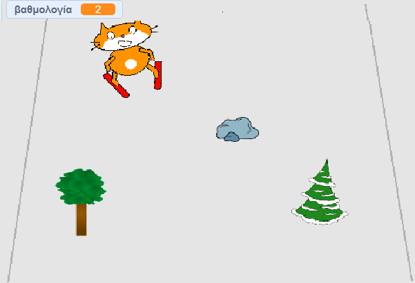

--- no-print ---

Αυτή είναι η **Scratch 3** έκδοση του έργου. Υπάρχει επίσης η [έκδοση Scratch 2 του έργου](https://projects.raspberrypi.org/el-GR/projects/scratch-cat-goes-skiing-scratch2).

--- /no-print ---

## Εισαγωγή

Πρόκειται να χρησιμοποιήσεις το Scratch για να δημιουργήσεις ένα παιχνίδι σκι στο οποίο πρέπει να αποφεύγεις εμπόδια που εμφανίζονται τυχαία για να μαζεύεις πόντους.

### Τι θα φτιάξεις

--- no-print ---

Κάνε κλικ στην πράσινη σημαία για να ξεκινήσεις. Χρησιμοποίησε το αριστερό και το δεξί βελάκι για τον έλεγχο του σκιέρ.

  <iframe allowtransparency="true" width="485" height="402" src="//scratch.mit.edu/projects/embed/406247995/?autostart=false" frameborder="0" scrolling="no"></iframe>
  

--- /no-print ---

--- print-only ---

--- /print-only ---

--- collapse ---
---
title: Τι θα χρειαστείς
---

### Υλικό (Hardware)

+ Ένας υπολογιστής ικανός να τρέχει το Scratch

### Λογισμικό

+ Scratch 3 (είτε [online](https://rpf.io/scratchon){:target="_blank"} είτε [offline](https://rpf.io/scratchoff){:target="_blank"})

### Λήψεις

Το αρχικό project μπορεί να βρεθεί [εδώ](https://rpf.io/p/el-GR/scratch-cat-goes-skiing-go){:target="_blank"}.

--- /collapse ---

--- collapse ---
---
title: Τι θα μάθεις
---

+ Πώς να ελέγχεις αντικείμενα χρησιμοποιώντας το πληκτρολόγιο
+ Πώς να σχεδιάζεις ένα σκηνικό
+ Πώς να κάνεις τα αντικείμενα να κινούνται
+ Πώς να χρησιμοποιείς τυχαίους αριθμούς

--- /collapse ---

--- collapse ---
---
title: Πρόσθετες πληροφορίες για εκπαιδευτικούς
---

--- no-print ---

Αν θέλεις να εκτυπώσεις αυτό το έργο, χρησιμοποίησε την [εκτυπώσιμη έκδοση](https://projects.raspberrypi.org/el-GR/projects/scratch-cat-goes-skiing/print){:target="_blank"}.

--- /no-print ---

Μπορείς να βρεις [το ολοκληρωμένο έργο εδώ](https://rpf.io/p/el-GR/scratch-cat-goes-skiing-get){:target="_blank"}.

--- /collapse ---
