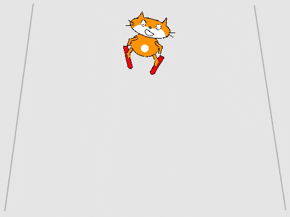

## Ελέγχοντας τον σκιέρ

Θα χρησιμοποιείς τα αριστερά και δεξιά βελάκια για να ελέγχεις το αντικείμενο γάτα σκιέρ, κάνοντάς το να πηγαίνει αριστερά και δεξιά στην πλαγιά.



--- task ---

Πρώτα, κάνε τον σκιέρ να κινείται και να δείχνει προς τα αριστερά. Ο κώδικάς σου πρέπει να κάνει τα εξής:

1. Ξεκινάει `όταν πατηθεί πλήκτρο αριστερό βέλος`{:class="block3events"}
1. Αλλάζει την κατεύθυνση που `δείχνει` {:class="block3motion"} το αντικείμενο
1. Μετακινεί το αντικείμενο προς τα αριστερά `αλλάζοντας το x`{:class="block3motion"}


```blocks3
when [left arrow v] key pressed
point in direction (105 v)
change x by (-10)
```

--- /task ---

--- task ---

Χρησιμοποίησε μπλοκ παρόμοια με τα παραπάνω για να κάνεις τον σκιέρ να μετακινείται προς τα δεξιά `όταν πατηθεί πλήκτρο δεξί βέλος`{:class="block3events"}.

--- hints ---

--- hint ---

Πρόσθεσε μπλοκ στον κώδικά σου, ώστε `όταν πατηθεί πλήκτρο δεξί βέλος`{: class="block3events"}, το αντικείμενο να ` δείξει προς κατεύθυνση 75 μοίρες`{:class="block3motion"} πριν `αλλάξει x κατά 10`{:class="block3motion"}

--- /hint ---

--- hint ---

Θα χρειαστείς αυτά τα μπλοκ:

```blocks3

point in direction (75 v)

when [right arrow v] key pressed

change x by (10)
```

--- /hint ---

--- hint ---

Ο κώδικας θα πρέπει να μοιάζει κάπως έτσι:


```blocks3
when [right arrow v] key pressed
point in direction (75 v)
change x by (10)
```

--- /hint ---

--- /hints ---

--- /task ---

--- task ---

Δοκίμασε το έργο σου

--- /task ---