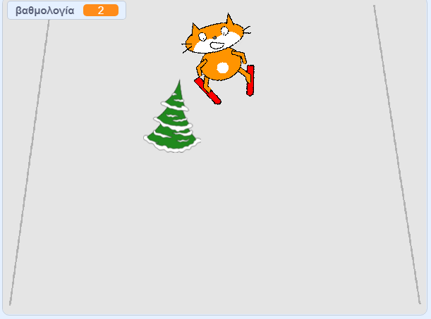

## Προσθήκη βαθμολογίας

Κάθε φορά που ο σκιέρ περνάει ένα εμπόδιο, θα πρέπει να κερδίζει πόντους.



--- task ---

Δημιούργησε μία νέα `μεταβλητή`{:class="block3variables"} με το όνομα `βαθμολογία`{:class="block3variables"}

--- /task ---

--- task ---

Πρόσθεσε κώδικα στο αντικείμενο εμπόδιο για να ορίζεις τη `βαθμολογία`{:class="block3variables"} σε μηδέν στην αρχή του παιχνιδιού.

[[[generic-scratch3-add-variable]]]


```blocks3
when green flag clicked
+ set [βαθμολογία v] to [0]
```

--- /task ---

--- task ---

Άλλαξε το πρόγραμμα έτσι ώστε όταν το εμπόδιο φτάσει στην κορυφή της σκηνής, να `αλλάζει τη βαθμολογία κατά 1`{:class="block3variables"}.

Ο νέος κώδικας για το εμπόδιο θα πρέπει να έχει την εξής μορφή:


```blocks3
when green flag clicked
set [βαθμολογία v] to [0]
forever 
    set [εμπόδιο_x v] to (pick random (-200) to (200))
    go to x: (εμπόδιο_x) y: (-180)
    show
    glide (1) secs to x: (εμπόδιο_x) y: (180)
    hide
    wait (0.5) seconds
+   change [βαθμολογία v] by (1)
end
```

--- /task ---

--- task ---

Παίξε το παιχνίδι, δες πόσους πόντους μπορείς να κερδίσεις.

--- /task ---