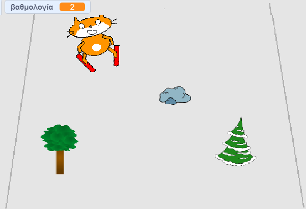

## Δοκιμασία: βάλε περισσότερα εμπόδια

Βάλε περισσότερα αντικείμενα από τη βιβλιοθήκη ως εμπόδια για να κάνεις το παιχνίδι σου πιο δύσκολο!

Όταν προσθέσεις ένα νέο εμπόδιο, θα πρέπει να σκεφτείς:

1. Ποιο αντικείμενο θα χρησιμοποιήσεις
1. Τι συμβαίνει όταν ο σκιέρ συγκρούεται με αυτό
1. Αν θα αυξηθεί το σκορ (και κατά πόσο) όταν ο σκιέρ το ξεπεράσει

Εάν χρειάζεσαι βοήθεια, πήγαινε στο βήμα αυτού του έργου, όπου δημιούργησες το πρώτο εμπόδιο.

