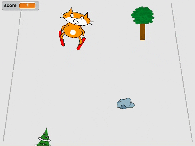

## Introduction

You are going to use Scratch to create a skiing game in which you have to avoid randomly appearing obstacles to score points.

### What you will make

--- collapse ---

---
title: What you will need
---

### Hardware

+ A computer capable of running Scratch 2.0

### Software

+ Scratch 2.0 (either [online](http://rpf.io/scratchon){:target="_blank"} or [offline](http://rpf.io/scratchoff){:target="_blank"})

--- /collapse ---

--- collapse ---

---
title: What you will learn
---

This project covers elements from the following strands of the [Raspberry Pi Digital Making Curriculum](http://rpf.io/curriculum){:target="_blank"}:

+ [Use basic programming constructs to create simple programs](https://www.raspberrypi.org/curriculum/programming/creator){:target="_blank"}

+ [Design basic 2D and 3D assets](https://www.raspberrypi.org/curriculum/design/creator){:target="_blank"}

--- /collapse ---

--- collapse ---

---
title: Additional resources
---

+ A [printer-friendly version of this project](https://projects.raspberrypi.org/en/projects/scratch-cat-goes-skiing/print){:target="_blank"}.
+ A Scratch starter project is available for [download here](resources/scratch_goes_skiing_starter.sb2)
+ The skiing Scratch cat sprite is available for [download here](resources/skiing_cat.sprite2)

--- /collapse ---