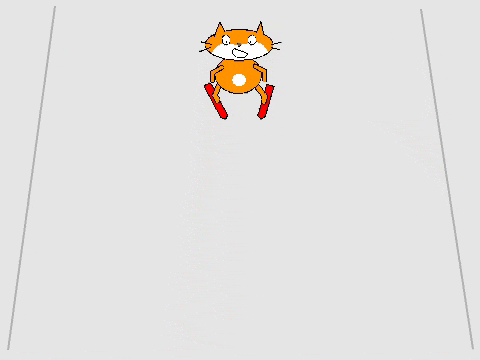

## Adding an obstacle

Obstacles to avoid will make your game more challenging and give a sense of movement as they appear at bottom of the screen and travel up.



+ Add in a new sprite for an obstacle (anything you think might be found on a ski slope).

[[[generic-scratch-sprite-from-library]]]

+ You now need to add the code so the obstacle:

    + appears at the bottom of the slope
    + moves up the screen
    + disappears when it reaches the top
    + waits for 1 second and thens repeat

--- hints ---

--- hint ---

`show`{:class="blocklooks"} and `hide`{:class="blocklooks"} will make a sprite appear and disappear while `goto`{:class="blockmotion"} and `glide to`{:class="blockmotion"} will make make a sprite move.

--- /hint ---

--- hint ---

+ When the `green flag is clicked`{:class="blockevents"}, `Loop forever`{:class="blockcontrol"}:

    + `Show`{:class="blocklooks"} the sprite
    + Make the sprite `go to`{:class="blockmotion"} the bottom of the slope `x = 0, y = -180`{:class="blockmotion"}
    + Make the sprite `glide to`{:class="blockmotion"} the top of the slope `x = 0, y = 180`{:class="blockmotion"}
    + `Hide`{:class="blocklooks"} the sprite
    + `Wait for 1 second`{:class="blockcontrol"}

--- /hint ---

--- hint ---

+ The code should look like this:

```blocks
    forever 
        go to x: (0) y: (-180)
        show
        glide (1) secs to x: (0) y: (180)
        hide
        wait (1) secs
    end
```

--- /hint ---

--- /hints ---
