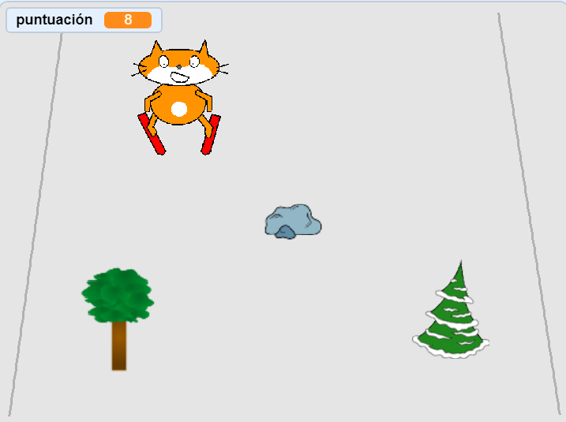

--- no-print ---

Esta es la versión **Scratch 3** del proyecto. También hay una [versión del proyecto en Scratch 2](https://projects.raspberrypi.org/en/projects/scratch-cat-goes-skiing-scratch2).

--- /no-print ---

## Introducción

Vas a usar Scratch para crear un juego de esquí en el que tendrás que evitar los obstáculos aleatorios que aparezcan para ganar puntos.

### Lo que harás

--- no-print ---

Haz clic en la bandera verde para empezar. Usa las teclas de flecha izquierda y derecha para controlar al esquiador.

  <iframe allowtransparency="true" width="485" height="402" src="//scratch.mit.edu/projects/embed/281116583/?autostart=false" frameborder="0" scrolling="no"></iframe>
  

--- /no-print ---

--- print-only ---

--- /print-only ---

--- collapse ---
---
title: Lo que necesitarás
---

### Hardware

+ Un ordenador capaz de ejecutar Scratch

### Software

+ Scratch 3 (either [online](https://rpf.io/scratchon){:target="_blank"} or [offline](https://rpf.io/scratchoff){:target="_blank"})

### Descargas

The starter project can be found [here](https://rpf.io/p/en/scratch-cat-goes-skiing-go){:target="_blank"}.

--- /collapse ---

--- collapse ---
---
title: Lo que vas a aprender
---

+ Cómo controlar los objetos usando el teclado
+ Cómo dibujar un fondo
+ Cómo animar objetos
+ Usar números aleatorios

--- /collapse ---

--- collapse ---
---
title: Información adicional para educadores
---

--- no-print ---

Si necesitas imprimir este proyecto, usa la [versión para imprimir](https://projects.raspberrypi.org/en/projects/scratch-cat-goes-skiing/print){:target="_blank"}.

--- /no-print ---

You can find the [completed project here](https://rpf.io/p/en/scratch-cat-goes-skiing-get){:target="_blank"}.

--- /collapse ---
