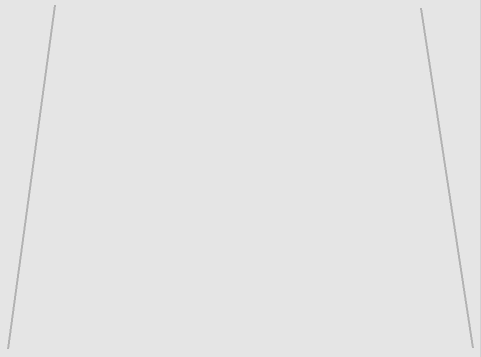

## Primeros pasos

--- task ---

Abrir el proyecto inicial de Scratch.

**En línea**: abre el proyecto de inicio en [rpf.io/skiingon](http://rpf.io/skiingon){:target="_blank"}.

Si tienes una cuenta de Scratch puedes hacer una copia haciendo clic en **Remix**.

**Sin conexión**: abre el [proyecto de inicio](http://rpf.io/p/en/scratch-cat-goes-skiing-go){:target="_blank"} en el editor sin conexión.

Si necesitas descargar e instalar el editor sin conexión de Scratch, puedes encontrarlo en [rpf.io/scratchoff](http://rpf.io/scratchoff){:target="_blank"}.

En el proyecto de inicio, deberías ver un fondo en blanco y un objeto esquiador.


--- /task ---

--- task ---

Pinta un nuevo fondo para tu pendiente de esquí: llena el gris de fondo y añade algunas líneas rectas.



[[[generic-scratch3-paint-new-backdrop]]]

--- /task ---

--- task ---

Añade código a tu objeto gato esquiador para que aparezca en la parte superior de la pendiente mirando hacia abajo `cuando se haga clic en la bandera`{:class="block3events"}.


```blocks3
when green flag clicked
go to x: (0) y: (100)
point in direction (90 v)
```

--- /task ---

--- task ---

Guarda y prueba tu proyecto.

[[[generic-scratch3-saving]]]

--- /task ---
