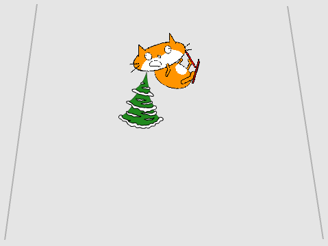

## Chocando

Si el esquiador se estrella contra un obstáculo, debería caer y hacer que el juego termine.



--- task ---

Cambia el código del objeto del esquiador a `espere hasta que`{:class="block3control"} está `tocando`{:class="block3sensing"} el obstáculo y, a continuación, `detener todo`{:class="block3control"}.


```blocks3
when green flag clicked
wait until <touching [Tree2 v] ?>
stop [all v]
```

--- /task ---

--- task ---

Cuando el esquiador se estrella, también deberías `cambiar el disfraz a caído`{:class="block3looks"}.

El código actualizado debería verse así:


```blocks3
when green flag clicked
wait until <touching [Tree2 v] ?>
+ switch costume to (fallenover v)
stop [all v]
```

--- /task ---

--- task ---

Guarda y prueba tu código. Cuando el esquiador golpea el obstáculo, el disfraz debe cambiar y el juego debe terminar.

--- /task ---

Sin embargo, ahora hay un problema con tu juego: la próxima vez que lo ejecutes, el esquiador seguirá usando el disfraz `caído`{:class="block3looks"}.

--- task ---

Edita el esquiador para que su disfraz vuelva a `esquiando`{:class="block3looks"} cuando el juego comienza por `cambiando el disfraz a esquiando`{:class="block3looks"}.


```blocks3
when green flag clicked
+ switch costume to (skiing v)
wait until <touching [Tree2 v] ?>
switch costume to (fallenover v)
stop [all v]
```

--- /task ---