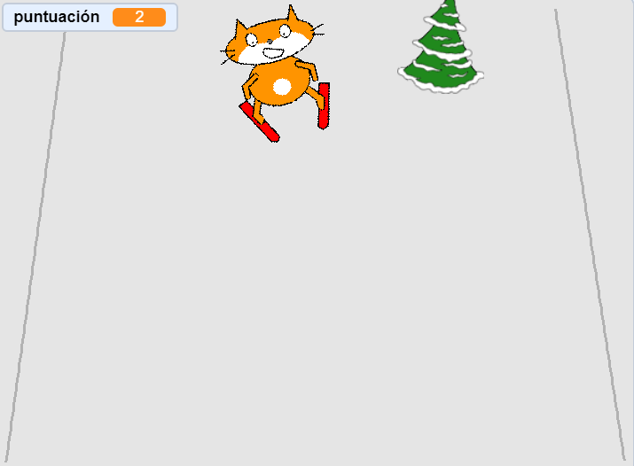

## Añadir una puntuación

Cada vez que el objeto esquiador supere un obstáculo, debería ganar puntos.



--- task ---

`Haz una variable`{:class="block3variables"} llamada `puntuación`{:class="block3variables"}

--- /task ---

--- task ---

Añade un script al objeto de obstáculo para establecer `puntuación`{:class="block3variables"} a cero al comienzo del juego.

[[[generic-scratch3-add-variable]]]


```blocks3
when green flag clicked
+ set [score v] to [0]
```

--- /task ---

--- task ---

Cambia el código para que cuando el obstáculo llegue a la parte superior de la pantalla, `se sume a puntuación 1`{:class="block3variables"}.

El script actualizado para el objeto debería verse así:


```blocks3
when green flag clicked
set [score v] to [0]
forever 
    set [obstacle_x v] to (pick random (-200) to (200))
    go to x: (obstacle_x) y: (-180)
    show
    glide (1) secs to x: (obstacle_x) y: (180)
    hide
    wait (0.5) seconds
+   change [score v] by (1)
end
```

--- /task ---

--- task ---

Juega con el juego, mira cuántos puntos puedes anotar.

--- /task ---