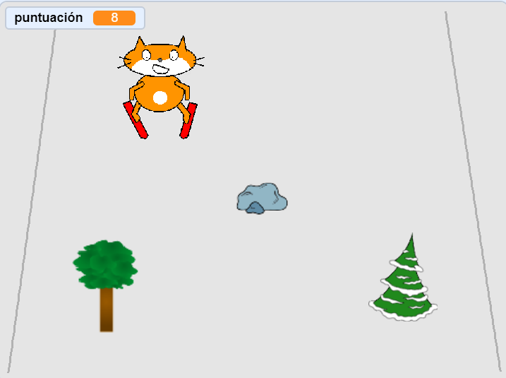

## Desafío: añadiendo más obstáculos

¡Añade más objetos de la biblioteca como obstáculos para hacer tu juego más complicado!

Cuando añadas un nuevo obstáculo, deberás pensar en:

1. Qué objeto usar
1. Qué sucede cuando el esquiador se estrella con él
1. Aumentar la puntuación (y cuánto) cuando el esquiador lo evita

Si necesitas ayuda, vuelve al paso del proyecto donde creaste el primer obstáculo.

