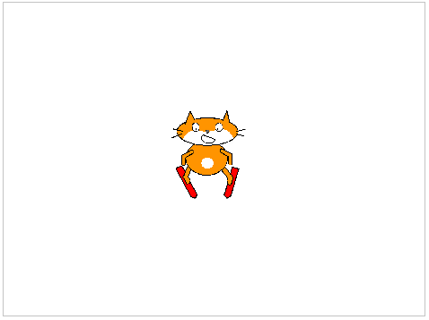

## Comenzar

--- task ---

Abre el proyecto inicial de Scratch.

**En línea**: abre el proyecto de inicio en [scratch.mit.edu/projects/406833896](https://scratch.mit.edu/projects/406833896){:target="_blank"}.

Si tienes una cuenta Scratch puedes hacer una copia al hacer clic en **Remix**.

**Sin conexión**: abre el [proyecto inicial](http://rpf.io/p/es-LA/scratch-cat-goes-skiing-go){:target=_blank"} en el editor sin conexión.

Si necesitas descargar e instalar el editor offline de Scratch, puedes encontrarlo en [rpf.io/scratchoff](http://rpf.io/scratchoff){:target="_blank"}.

En el proyecto de inicio, deberías ver un fondo en blanco y un objeto esquiador.



--- /task ---

--- task ---

Pinta un nuevo fondo para tu pista de esquí: rellena el fondo de color gris y añade algunas líneas rectas.


[[[generic-scratch3-paint-new-backdrop]]]

--- /task ---

--- task ---

Añade código a tu objeto gato esquí para que aparezca en la parte superior de la pista mirando hacia abajo `cuando se haga clic en la bandera`{:class="block3events"}.


```blocks3
when green flag clicked
go to x: (0) y: (100)
point in direction (90 v)
```

--- /task ---

--- task ---

Guarda y prueba tu proyecto.

[[[generic-scratch3-saving]]]

--- /task ---
