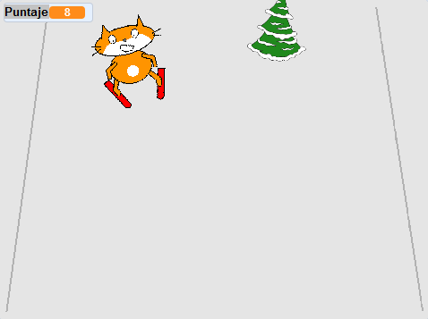

## Añadir una puntuación

Cada vez que el objeto esquiador supere un obstáculo, deberían ganar puntos.



--- task ---

`Haz una variable`{:class="block3variables"} que se llame `puntuación`{:class="block3variables"}

--- /task ---

--- task ---

Añade un script al objeto de obstáculo para establecer `puntuación`{:class="block3variables"} a cero al comienzo del juego.

[[[generic-scratch3-add-variable]]]


```blocks3
al hacer clic en la bandera verde
+ establecer [puntuación v] a [0]
```

--- /task ---

--- task ---

Cambia el código para que cuando el obstáculo llegue a la parte superior de la pantalla, `cambiar puntuación a 1`{:class="block3variables"}.

El script actualizado para el objeto debería verse así:


```blocks3
al hacer clic en la bandera verde
+ establecer [puntuación v] a [0]
por siempre 
    establecer [obstáculo_x v] to (número al azar (-200) to (200))
    ir a x: (0) y: (-180)
    mostrar
    deslizar en (1) segs a x: (0) y: (180)
    ocultar
    esperar (0.5) segundos
+   cambiar [puntuación v] en (1)
fin
```

--- /task ---

--- task ---

Empieza el juego, mira cuántos puntos puedes anotar.

--- /task ---