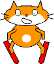

## Collision

Si le skieur heurte un obstacle, il devrait tomber et le jeu devrait se terminer.


--- task ---

Change le code du sprite skieur pour `attendre jusqu'à`{:class="block3control"} ce qu'il `touche`{:class="block3sensing"} l'obstacle, et ensuite `stopper tout`{:class="block3control"}.



```blocks3
when green flag clicked
wait until <touching [Arbre v] ?>
stop [all v]
```

--- /task ---

--- task ---

Quand le skieur se plante, tu devras aussi `basculer sur le costume de chute`{:class="block3looks"}.

Le code mis à jour devrait ressembler à ceci :


```blocks3
when green flag clicked
wait until <touching [Arbre v] ?>
+ switch costume to (chute v)
stop [all v]
```

--- /task ---

--- task ---

Enregistre et teste ton code. Lorsque le skieur heurte l'obstacle, le costume doit changer et le jeu doit s'arrêter.

--- /task ---

Cependant, il y a un problème avec ton jeu : la prochaine fois que tu le lanceras, le skieur portera toujours le costume `chute`{:class="block3looks"}.

--- task ---

Modifie le skieur pour que son costume revienne sur `skie`{:class="block3looks"} quand le jeu commence par `bascule le costume sur skie`{:class="block3looks"}.


```blocks3
when green flag clicked
+ switch costume to (skie v)
wait until <touching [Arbre v] ?>
switch costume to (chute v)
stop [all v]
```

--- /task ---