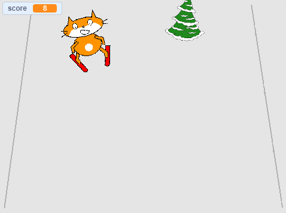

## एक अंक जोड़ना

हर बार स्कीयर स्प्राइट इसे एक बाधा बना देता है, उन्हें अंक अर्जित करने चाहिए।



--- task ---

` क चर बनाएं`{:class="block3variables"} जिसे ` स्कोर`{:class="block3variables"} कहा जाता है

--- /task ---

--- task ---

` स्कोर सेट करने के लिए बाधा स्प्राइट में एक स्क्रिप्ट जोड़ें ` {= खेल की शुरुआत में शून्य पर "class =" block3variables "}।

[[[generic-scratch3-add-variable]]]


```blocks3
when green flag clicked
+ set [score v] to [0]
```

--- /task ---

--- task ---

कोड को बदलें ताकि जब बाधा स्क्रीन के शीर्ष पर पहुंच जाए, तो यह ` 1 से स्कोर बदलता है ` {: वर्ग = "block3variables"}।

स्प्राइट के लिए अद्यतन स्क्रिप्ट इस तरह दिखनी चाहिए:


```blocks3
when green flag clicked
set [score v] to [0]
forever 
    set [obstacle_x v] to (pick random (-200) to (200))
    go to x: (obstacle_x) y: (-180)
    show
    glide (1) secs to x: (obstacle_x) y: (180)
    hide
    wait (0.5) seconds
+   change [score v] by (1)
end
```

--- /task ---

--- task ---

गेम खेलें, देखें कि आप कितने अंक ले सकते हैं।

--- /task ---