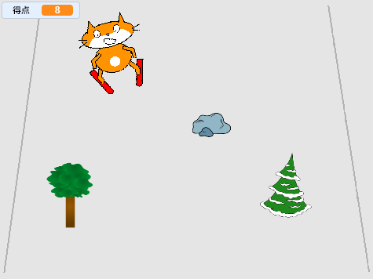

--- no-print ---

これはプロジェクトの**Scratch 3**バージョンです。 [Scratch 2バージョンのプロジェクト](https://projects.raspberrypi.org/en/projects/scratch-cat-goes-skiing-scratch2)もあります。

--- /no-print ---

## はじめに

Scratchを使って、ランダムに現れる障害物を避けて得点するスキーゲームをつくります。

### 作るもの

--- no-print ---

緑の旗（はた）をクリックしてスタートします。 左右の矢印キーを使ってスキーヤーを操作します。

  <iframe allowtransparency="true" width="485" height="402" src="//scratch.mit.edu/projects/embed/281116583/?autostart=false" frameborder="0" scrolling="no"></iframe>
  

--- /no-print ---

--- print-only ---

--- /print-only ---

--- collapse ---
---
title: 必要なもの
---

### ハードウェア

+ Scratchを実行できるコンピュータ

### ソフトウェア

+ Scratch 3 (either [online](https://rpf.io/scratchon){:target="_blank"} or [offline](https://rpf.io/scratchoff){:target="_blank"})

### ダウンロード

The starter project can be found [here](https://rpf.io/p/en/scratch-cat-goes-skiing-go){:target="_blank"}.

--- /collapse ---

--- collapse ---
---
title: 学ぶこと
---

+ キーボードを使ってスプライトを操作する方法
+ 背景を描（えが）く方法
+ スプライトを動かす方法
+ 乱数（らんすう）を使う方法

--- /collapse ---

--- collapse ---
---
title: 教育者向けの追加情報
---

--- no-print ---

このプロジェクトを印刷する必要がある場合は、[印刷用バージョン](https://projects.raspberrypi.org/en/projects/scratch-cat-goes-skiing/print){:target="_ blank"}を使用してください。

--- /no-print ---

You can find the [completed project here](https://rpf.io/p/en/scratch-cat-goes-skiing-get){:target="_blank"}.

--- /collapse ---
