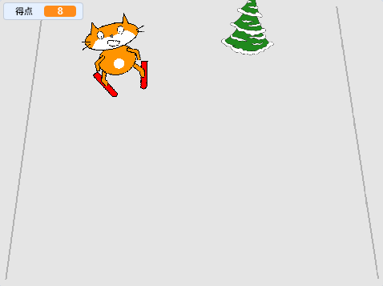

## 得点を追加する

スキーヤーのスプライトが障害物を通過するたびに、得点を得られるようにする必要があります。



--- task ---

`得点`{:class="block3variables"}という名前の`変数を作ります`{:class="block3variables"}。

--- /task ---

--- task ---

スクリプトを障害物のスプライトに追加して、ゲーム開始時に`得点`{:class="block3variables"}をゼロに設定します。

[[[generic-scratch3-add-variable]]]


```blocks3
when green flag clicked
+ set [得点 v] to [0]
```

--- /task ---

--- task ---

コードを変更し、障害物が画面の上部に達したときに、`得点を1ずつ変更します`{:class="block3variables"}

スプライト用に更新されたスクリプトは次のようになります：


```blocks3
when green flag clicked
set [得点 v] to [0]
forever 
    set [障害物_x v] to (pick random (-200) to (200))
    go to x: (障害物_x) y: (-180)
    show
    glide (1) secs to x: (障害物_x) y: (180)
    hide
    wait (0.5) seconds
+   change [得点 v] by (1)
end
```

--- /task ---

--- task ---

ゲームで遊んで、何点取れるか確認してください。

--- /task ---