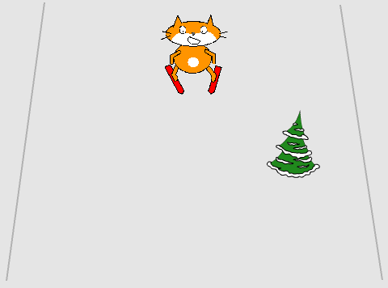

## 장애물 추가하기

피할 장애물이 있으면 게임이 더 재밌을 것입니다. 그리고 장애물이 화면 아래에서 나타나 위로 다가오게 하면 어떻게 움직일 지 감을 잡을 수 있게 할 것입니다.

--- no-print ---


--- /no-print ---

--- print-only ---



--- /print-only ---

--- task ---

라이브러리에서 장애물 역할을 할 스프라이트를 선택하세요. - 스키 슬로프에서 나타날 수 있는 무엇이든 좋습니다. 이 새로운 스프라이트를 추가하세요.

[[[generic-scratch3-sprite-from-library]]]

--- /task ---

--- task ---

이제 이 스프라이트를 움직이게 하기 위해 코드를 추가해야 합니다.

1. 슬로프의 아래로 `이동`{:class="block3motion"}해서 `보이기`{:class="block3looks"} 합니다.
1. 스크린 위로 `이동`{:class="block3motion"} 해야 합니다.
1. 위에 도착하면 `숨기기`{:class="block3looks"} 합니다.
1. `1초 기다리기`{:class="block3control"} 하고, 이를 반복합니다.


```blocks3
when green flag clicked
forever 
    go to x: (0) y: (-180)
    show
    glide (1) secs to x: (0) y: (180)
    hide
    wait (1) seconds
end
```

--- /task ---
