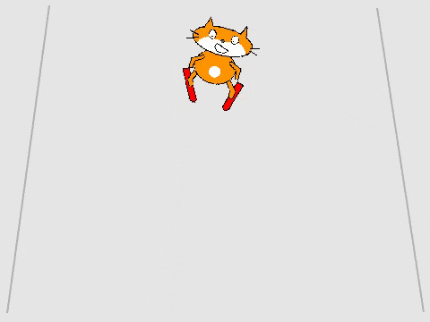

## Bestuur de skiër

Je gebruikt de linker- en rechter-pijltjestoetsen om de skiër sprite te besturen, waardoor deze links en rechts over de helling skiet.



--- task ---

Laat de skiër eerst bewegen en naar links wijzen. Je code moet:

1. Starten `wanneer de linker-pijltjestoets wordt ingedrukt`{:class="block3events"}
1. De hoek waarin de sprite `wijst`{:class="block3motion"} veranderen
1. De sprite naar links laten bewegen door `verander x met`{:class="block3motion"}


```blocks3
when [left arrow v] key pressed
point in direction (105 v)
change x by (-10)
```

--- /task ---

--- task ---

Gebruik blokken zoals hierboven om de sprite naar rechts te laten bewegen `wanneer de rechter-pijltjestoets is ingedrukt`{:class="block3events"}.

--- hints ---


--- hint ---

Voeg blokken aan je code toe zodat `wanneer rechter-pijltjestoets is ingedrukt`{:class="block3events"}, de sprite zich `richt naar 75 graden`{:class="block3motion"} voordat `verander x met 10`{:class="block3motion:}

--- /hint ---

--- hint ---

Je hebt deze blokken nodig:

```blocks3

point in direction (75 v)

when [right arrow v] key pressed

change x by (10)
```

--- /hint ---

--- hint ---

Je code zou er als volgt uit moeten zien:


```blocks3
when [right arrow v] key pressed
point in direction (75 v)
change x by (10)
```

--- /hint ---

--- /hints ---

--- /task ---

--- task ---

Test je programma

--- /task ---