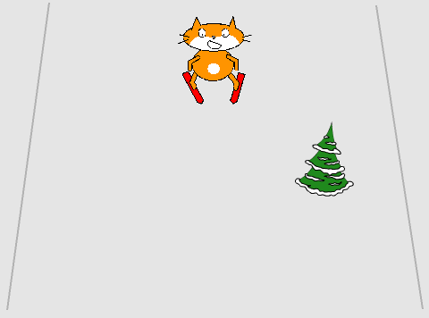

## Een obstakel toevoegen

Je spel wordt spannender door obstakels te hebben, en ze onderaan het scherm tevoorschijn te laten komen en ze omhoog te laten bewegen waardoor je het idee krijgt dat ze bewegen.

--- no-print ---


--- /no-print ---

--- print-only ---



--- /print-only ---

--- task ---

Kies een sprite uit de bibliotheek die kan dienen als obstakel — het kan alles zijn waarvan jij vindt dat het op een skihelling thuishoort. Voeg de nieuwe sprite toe.

[[[generic-scratch3-sprite-from-library]]]

--- /task ---

--- task ---

Nu moet je code toevoegen om je sprite te laten bewegen:

1. `Ga naar`{:class="block3motion"} de onderkant van de helling en `verschijn`{:class="block3looks"}
1. `Schuif`{:class="block3motion"} het speelveld op
1. `Verdwijn`{:class="block3looks"} wanneer het boven aan de helling is
1. `Wacht 1 sec`{:class="block3control"} en herhaal


```blocks3
when green flag clicked
forever 
    go to x: (0) y: (-180)
    show
    glide (1) secs to x: (0) y: (180)
    hide
    wait (1) seconds
end
```

--- /task ---
