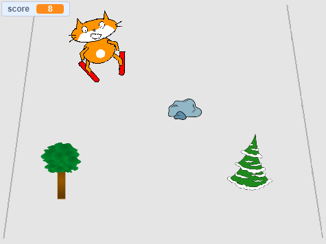

--- no-print ---

To jest wersja projektu korzystająca ze **Scratch 3**. Istnieje również [wersja tego projektu dla Scratch 2](https://projects.raspberrypi.org/en/projects/scratch-cat-goes-skiing-scratch2).

--- /no-print ---

## Wprowadzenie

Za pomocą Scratch stworzysz grę narciarską, w której musisz unikać losowo pojawiających się przeszkód, aby zdobyć punkty.

### Co stworzysz

--- no-print ---

Kliknij na zieloną flagę, aby rozpocząć. Użyj klawiszy strzałka w prawo i strzałka w lewo, aby kontrolować narciarza.

  <iframe allowtransparency="true" width="485" height="402" src="//scratch.mit.edu/projects/embed/281116583/?autostart=false" frameborder="0" scrolling="no"></iframe>
  

--- /no-print ---

--- print-only ---

--- /print-only ---

--- collapse ---
---
title: Czego będziesz potrzebować
---

### Sprzęt

+ Komputer, na którym można uruchomić Scratch

### Oprogramowanie

+ Scratch 3 ([online](https://rpf.io/scratchon){:target="_blank"} lub [offline](https://rpf.io/scratchoff){:target="_blank"})

### Pliki do pobrania

Projekt początkowy można znaleźć [tutaj](https://rpf.io/p/en/scratch-cat-goes-skiing-go){:target="_blank"}.

--- /collapse ---

--- collapse ---
---
title: Czego się nauczysz
---

+ Jak kontrolować duszka za pomocą klawiatury
+ Jak narysować tło
+ Jak animować duszka
+ Używania liczb losowych

--- /collapse ---

--- collapse ---
---
title: Dodatkowe informacje dla nauczycieli
---

--- no-print ---

Jeśli chcesz wydrukować ten projekt, użyj wersji [do druku](https://projects.raspberrypi.org/en/projects/scratch-cat-goes-skiing/print){:target="_blank"}}.

--- /no-print ---

Możesz znaleźć ukończony projekt [tutaj](https://rpf.io/p/en/scratch-cat-goes-skiing-get){:target="_blank"}.

--- /collapse ---
