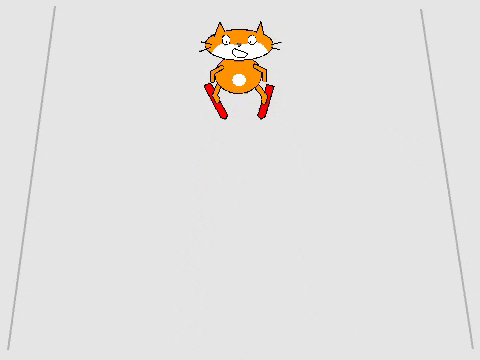

## Dodawanie przeszkody

Przeszkody sprawią, że gra będzie trudniejsza, a pojawianie się ich na dole ekranu i podróżowanie w górę stworzy poczucie ruchu.

--- no-print ---



--- /no-print ---

--- print-only ---


--- /print-only ---

--- task ---

Wybierz z biblioteki duszka, który będzie przeszkodą — może to być wszystko, co Twoim zdaniem można znaleźć na stoku narciarskim. Dodaj wybranego duszka.

[[[generic-scratch3-sprite-from-library]]]

--- /task ---

--- task ---

Teraz musisz dodać kod, aby poruszyć duszka:

1. `Idź do`{:class="block3motion"} dół stoku i `pokaż`{:class="block3looks"}
1. `Przesuń`{:class="block3motion"} w górę ekranu
1. `Ukryj`{:class="block3looks"}, gdy osiągnie górę stoku
1. `Poczekaj 1 sekundę`{:class="block3control"}, a następnie powtórz


```blocks3
when green flag clicked
forever 
    go to x: (0) y: (-180)
    show
    glide (1) secs to x: (0) y: (180)
    hide
    wait (1) seconds
end
```

--- /task ---
