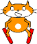

## Zderzenia

Jeśli narciarz uderzy w przeszkodę, pownien spaść i gra powinna się zakończyć.


--- task ---

Zmień kod dla duszek narciarza na `poczekaj aż`{:class="block3control"}`dotyka`{:class="block3sensing"} przeszkodę, a następnie `zatrzymaj wszystko`{:class="block3control"}.



```blocks3
when green flag clicked
wait until <touching [Tree2 v] ?>
stop [all v]
```

--- /task ---

--- task ---

Kiedy narciarz rozbije sie, powinieneś również `przełączyć kostium na upadek`{:class="block3looks"}.

Zaktualizowany kod powinien wyglądać następująco:


```blocks3
when green flag clicked
wait until <touching [Tree2 v] ?>
+ switch costume to (fallenover v)
stop [all v]
```

--- /task ---

--- task ---

Zapisz i przetestuj swój kod. Gdy narciarz uderzy w przeszkodę, wygląd duszka powinien się zmienić, a gra powinna się zatrzymać.

--- /task ---

Jest jednak problem z twoją grą: następnym razem, gdy ją uruchomisz, narciarz będzie nadal nosił`przewrócony`{:class="block3looks"} Kostium.

--- task ---

Edytuj narciarza, aby jego kostium zmienił się z powrotem na `jazda na nartach`{:class="block3looks"}, gdy gra rozpoczyna się od `przełączenia kostiumu na jazdę na nartach `{:class="block3looks"}.


```blocks3
when green flag clicked
+ switch costume to (skiing v)
wait until <touching [Tree2 v] ?>
switch costume to (fallenover v)
stop [all v]
```

--- /task ---