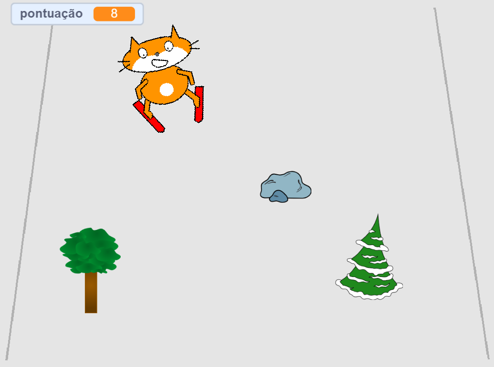

--- no-print ---

Esta é a versão **Scratch 3** do projeto. Há também uma [versão Scratch 2 do projeto](https://projects.raspberrypi.org/pt-BR/projects/scratch-cat-goes-skiing-scratch2).

--- /no-print ---

## Introdução

Você vai usar o Scratch para criar um jogo de esqui no qual você tem que evitar obstáculos que aparecem aleatoriamente para marcar pontos.

### O que você vai fazer

--- no-print ---

Clique na bandeira verde para começar. Use as setas para a esquerda e para a direita para controlar o esquiador.

  <iframe allowtransparency="true" width="485" height="402" src="//scratch.mit.edu/projects/embed/406836366/?autostart=false" frameborder="0" scrolling="no"></iframe>
  

--- /no-print ---

--- print-only ---

--- /print-only ---

--- collapse ---
---
title: O que você precisará
---

### Hardware

+ Um computador capaz de executar o Scratch

### Software

+ Scratch 3 ([online](http://rpf.io/scratchon){:target="_blank"} ou [offline](http://rpf.io/scratchoff){:target="_blank"})

### Downloads

O projeto inicial pode ser encontrado [aqui](http://rpf.io/p/pt-BR/scratch-cat-goes-skiing-go){:target="_blank"}.

--- /collapse ---

--- collapse ---
---
title: O que você vai aprender
---

+ Como controlar atores usando o teclado
+ Como desenhar um cenário
+ Como animar atores
+ Usar números aleatórios

--- /collapse ---

--- collapse ---
---
title: Informações adicionais para educadores
---

--- no-print ---

Se você precisar imprimir este projeto, por favor, use a [versão para impressão](https://projects.raspberrypi.org/pt-BR/projects/scratch-cat-goes-skiing/print){:target="_blank"}.

--- /no-print ---

Você pode encontrar o [projeto concluído aqui](http://rpf.io/p/pt-BR/scratch-cat-goes-skiing-get){:target="_blank"}.

--- /collapse ---
