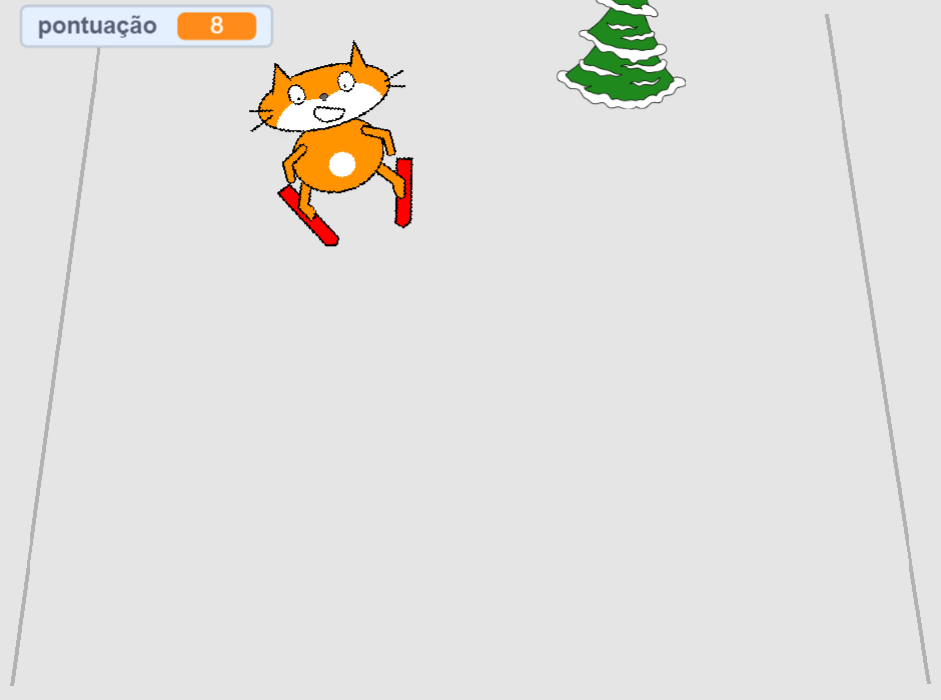

## Adicionando uma pontuação

Toda vez que o esquiador passa por um obstáculo, deve-se ganhar pontos.



--- task ---

`Faça uma variável`{:class="block3variables"} chamada `pontuação`{:class="block3variables"}

--- /task ---

--- task ---

Adicione um script ao ator do obstáculo para definir `pontuação`{:class="block3variables"} para zero no início do jogo.

[[[generic-scratch3-add-variable]]]


```blocks3
when green flag clicked
+ set [score v] to [0]
```

--- /task ---

--- task ---

Altere o código para que quando o obstáculo chegar ao topo da tela, ele `mude a pontuação em 1`{:class="block3variables"}.

O script atualizado para o ator deve ficar assim:


```blocks3
when green flag clicked
set [score v] to [0]
forever 
    set [obstacle_x v] to (pick random (-200) to (200))
    go to x: (obstacle_x) y: (-180)
    show
    glide (1) secs to x: (obstacle_x) y: (180)
    hide
    wait (0.5) seconds
+   change [score v] by (1)
end
```

--- /task ---

--- task ---

Jogue o jogo, veja quantos pontos você consegue fazer.

--- /task ---