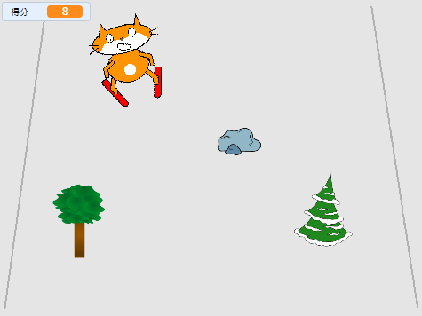

--- no-print ---

這個專案是 **Scratch 3** 版本。 另外還有 [Scratch 2](https://projects.raspberrypi.org/zh-TW/projects/scratch-cat-goes-skiing-scratch2) 版本。

--- /no-print ---

## 介紹

你將使用Scratch製作一款滑雪遊戲，在這種遊戲中，你必須避開隨機出現的障礙來得分。

### 你將會做出

--- no-print ---

點擊綠旗開始， 使用左右方向鍵控制滑雪者。

  <iframe allowtransparency="true" width="485" height="402" src="//scratch.mit.edu/projects/embed/281116583/?autostart=false" frameborder="0" scrolling="no"></iframe>
  

--- /no-print ---

--- print-only ---

--- /print-only ---

--- collapse ---
---
title: 你會用到
---

### 硬體

+ 能夠運行Scratch的電腦

### 軟體

+ Scratch 3 ([線上版](https://rpf.io/scratchon){:target="_blank"} 或 [離線版](https://rpf.io/scratchoff){:target="_blank"})

### 下載

起始項目可在[此處](https://rpf.io/p/zh-TW/scratch-cat-goes-skiing-go){:target="_blank"}找到。

--- /collapse ---

--- collapse ---
---
title: 你會學到
---

+ 如何使用鍵盤控制精靈
+ 如何繪製背景
+ 如何製作精靈動畫
+ 使用隨機數

--- /collapse ---

--- collapse ---
---
title: 給教師的其它資訊
---

--- no-print ---

如果您需要列印此專案內容，請下載 [列印版本](https://projects.raspberrypi.org/zh-TW/projects/scratch-cat-goes-skiing/print){:target="_blank"}。

--- /no-print ---

你可以在這裡找到[已經完成的專案](https://rpf.io/p/zh-TW/scratch-cat-goes-skiing-get){:target="_blank"}。

--- /collapse ---
