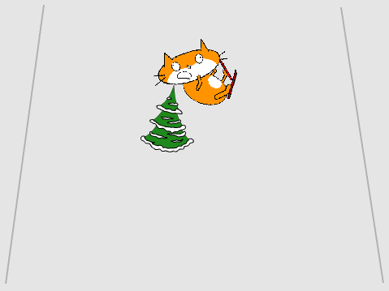

## 撞到

如果滑雪者撞上障礙物，它會倒下而比賽結束。



--- task ---

將滑雪者精靈的程式更改為，`直到`{:class="block3control"}它`撞上`{:class="block3sensing"}障礙物，然後`停止所有遊戲`{:class="block3control"}。


```blocks3
when green flag clicked
wait until <touching [Tree2 v] ?>
stop [all v]
```

--- /task ---

--- task ---

滑雪者撞到時，你還應`將造型換成摔倒的造型`{:class="block3looks"}。

更新後的程式應如下所示：


```blocks3
when green flag clicked
wait until <touching [Tree2 v] ?>
+ switch costume to (摔倒 v)
stop [all v]
```

--- /task ---

--- task ---

保存並測試你的程式。 當滑雪者撞到障礙物時，造型應更換，比賽就此停止。

--- /task ---

但是，你的遊戲現在存在問題：下次運行遊戲時，滑雪者仍會使用`摔倒`{:class="block3looks"}的造型。

--- task ---

編輯滑雪者的造型，使他們的造型變回`滑雪造型`{:class="block3looks"}，當遊戲開始時通過`將造型切換為滑雪造型`{:class="block3looks"}。


```blocks3
when green flag clicked
+ switch costume to (滑雪造型 v)
wait until <touching [Tree2 v] ?>
switch costume to (摔倒 v)
stop [all v]
```

--- /task ---