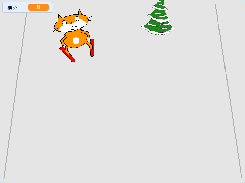

## 增加得分

每次滑雪者精靈閃過障礙物，他們都應獲得分數。



--- task ---

建立一個新`變量`{:class="block3variables"} 稱為 `得分`{:class="block3variables"}。

--- /task ---

--- task ---

將腳本添加到障礙物精靈以設置`得分`{:class="block3variables"}，得分在遊戲開始時為零。

[[[generic-scratch3-add-variable]]]


```blocks3
when green flag clicked
+ set [得分 v] to [0]
```

--- /task ---

--- task ---

更改程式，以便當障礙物到達屏幕頂部時，`得分從0變成1`{:class="block3variables"}。

精靈的更新腳本應如下所示：


```blocks3
when green flag clicked
set [得分 v] to [0]
forever 
    set [障礙物_X v] to (pick random (-200) to (200))
    go to x: (障礙物_X) y: (-180)
    show
    glide (1) secs to x: (障礙物_X) y: (180)
    hide
    wait (0.5) seconds
+   change [得分 v] by (1)
end
```

--- /task ---

--- task ---

玩遊戲，看看可以得到多少分。

--- /task ---